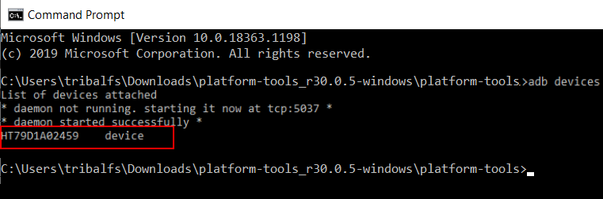

# Galaxy Max Hz

Some features of Galaxy Max Hz need **WRITE_SECURE_SETTINGS** permission in order to work. For additional details, you can check the app's [official xda-developers thread](https://forum.xda-developers.com/t/app-galaxy-max-hz-refresh-rate-control-quick-resolution-switcher-screen-off-mods-adaptive-mod-keep-high-adaptive-on-power-saving-mode-and-more.4181447/).

----------------------
### TLDR

 * Run `adb shell pm grant com.tribalfs.gmh android.permission.WRITE_SECURE_SETTINGS`

----------------------

Alternative methods:

For **rooted** devices without using a PC:
 *  Install a terminal emulator app from play store (e.g. [Termux](https://play.google.com/store/apps/details?id=com.termux)), grant root permission and run the following command: `su -c pm grant com.tribalfs.gmh android.permission.WRITE_SECURE_SETTINGS`.
or (2) Install this [mini-app](https://github.com/tribalfs/gmhWriteSecureSettings/releases), grant root permission and run.

For **non-rooted** devices using [LADB](https://play.google.com/store/apps/details?id=com.draco.ladb) app:
 * Execute `pm grant com.tribalfs.gmh android.permission.WRITE_SECURE_SETTINGS`

----------------------

Procedures to grant Galaxy Max Hz the WRITE_SECURE_SETTINGS permission using ADB:
----------------------

### 1. Enable developer mode in phone's settings

 * Go to `Settings` > `About phone` > `Software information` and tap `Build number` multiple times until the developer mode is enabled.


### 2. Enable USB debugging

 * Go to `Settings` > `Developer options` (can be `Settings` > `System` > `Developer options` on older android versions), scroll down and find `USB debugging` option.


### 3. Download ADB on your computer

 * Download ADB (platform-tools) to your computer:
    for [Windows](https://dl.google.com/android/repository/platform-tools-latest-windows.zip) |
    for [Mac](https://dl.google.com/android/repository/platform-tools-latest-darwin.zip) |
    for [Linux](https://dl.google.com/android/repository/platform-tools-latest-linux.zip)
    
 * Extract the downloaded zip file.

### 4. Navigate inside the folder that you extracted (i.e. inside platform-tools) from Windows Explorer or Finder(macOS)


### 5. Opening the command-line interface

#### For Windows: Open up CMD
  
 * Type `cmd` in the address bar and press enter.  This will open Windows Command Prompt.


#### For MacOS: Open up Terminal

 * Search `Terminal` from Launchpad and run it.

 * Run `sudo -s` and type your user password. **The terminal won't display how much characters you type, it'll remain blank.**

 * Run `export PATH=.:$PATH`

 **Without this, you will get `adb: command not found` errors.**


### 6. Connecting your phone to your computer

 * Your phone will prompt `Allow USB debugging` if it's the first time being connected on USB debugging mode.  Tap `OK`.


 * Check the connection by entering the following command followed by an enter. It should show your device ID if successfully connected.

 ```adb devices```
 
 
 
 
### 7. Actual granting of WRITE_SECURE_SETTINGS permission to Galaxy Max Hz

 * When successfully connected, enter the following to the command followed by an enter.  If the command executed properly, it'll return blank.

 ```adb shell pm grant com.tribalfs.gmh android.permission.WRITE_SECURE_SETTINGS```


### 8. You may now disable the USB debugging settings

 * If you don't need USB debugging, it's recommended to disable it to avoid potential unwanted access.

 * Go to `Settings` > `Developer options`, scroll down a page and **disable** `USB debugging` option.

**That's it!**

----------------------

Re-open Galaxy Max Hz. Done! 


You don't have to repeat this process unless you completely uninstall the app and reinstall it.
