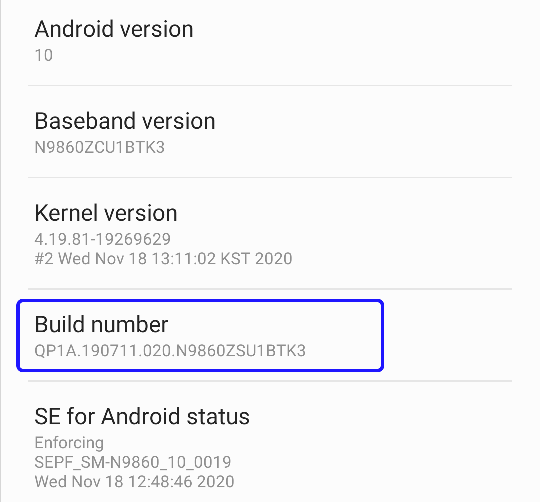
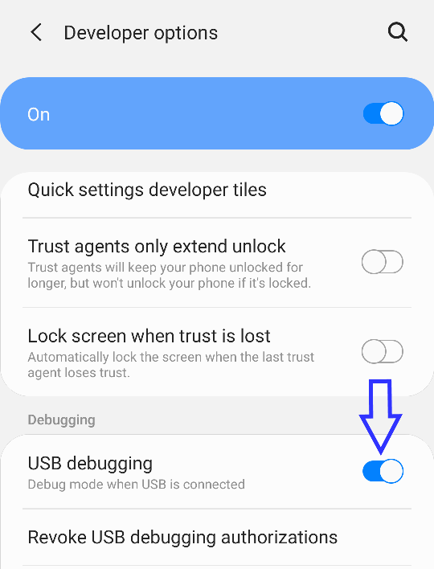
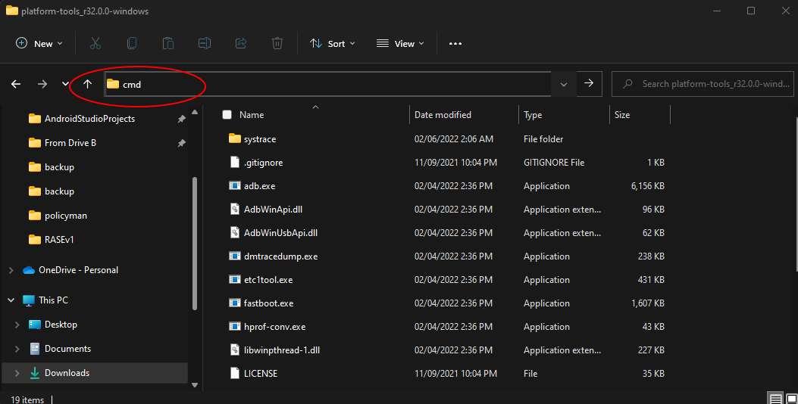
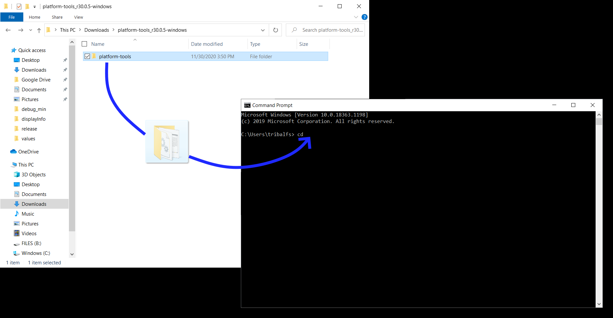
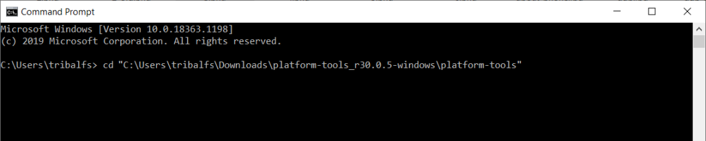
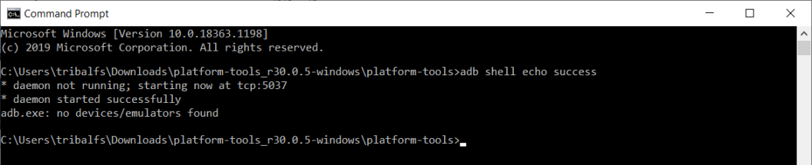
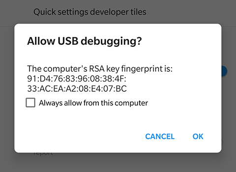
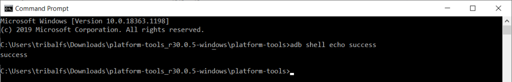
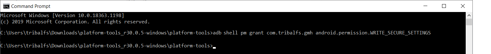

# Galaxy Max Hz

Some features of Galaxy Max Hz need **WRITE_SECURE_SETTINGS** permission in order to work. For additional details, you can check the [app's official xda-developers thread](https://forum.xda-developers.com/t/app-galaxy-max-hz-refresh-rate-control-quick-resolution-switcher-screen-off-mods-adaptive-mod-keep-high-adaptive-on-power-saving-mode-and-more.4181447/).

----------------------
### TLDR

 * Run `adb shell pm grant com.tribalfs.gmh android.permission.WRITE_SECURE_SETTINGS`

----------------------

If your device is **rooted**, you can grant the WRITE_SECURE_SETTINGS without the need of a PC.  Install any terminal emulator app from play store (e.g. [Termux](https://play.google.com/store/apps/details?id=com.termux)) and run the above adb command as root(i.e. `adb shell su -c pm grant com.tribalfs.gmh android.permission.WRITE_SECURE_SETTINGS`)

For  **non-rooted devices**, do the following procedures:

----------------------

### 1. Enable developer mode

 * Go to `Settings` > `About phone` > `Software information` and tap `Build number` multiple times until the developer mode is enabled.



### 2. Enable USB debugging

 * Go to `Android Settings app` > `System` > `Developer options`, scroll down a page and enable `USB debugging` option.



### 3. Download ADB on your computer

 * Check [here](https://www.xda-developers.com/google-releases-separate-adb-and-fastboot-binary-downloads) and download ADB for your computer.

 * Extract the downloaded zip file.

### 4. Connect your phone to your computer

----------------------

### 5. Using command-line

#### 5.1. Windows: Open up CMD

 * Press `Windows + R` key on your keyboard.

 * Type `cmd` and hit enter.



#### 5.2. macOS: Open up Terminal

 * Search `Terminal` from Launchpad and run it.

 * Run `sudo -s` and type your user password. **The terminal won't display how much characters you type, it'll remain blank.**

 * Run `export PATH=.:$PATH`

 **Without this, you will get `adb: command not found` errors.**

### 6. Locate ADB

 * From the terminal window, type "cd ". **Notice the empty whitespace after the "cd".**

 * Locate the extracted `platform-tools` folder from Windows Explorer or Finder(macOS) and drag it over to the terminal window. It'll auto-fill the path.



 * Press enter.



### 7. Allow your computer to be used for USB debugging

 * Enter the following to the CMD window, followed by an enter:

 ```adb shell echo success```

 * You can copy the commands and paste it by **right-clicking on the CMD window**.



 * The command may show an error, **this is normal**. Your phone will prompt `Allow USB debugging` for you.

 * If it doesn't show an error, skip this step.



 * Tap `OK`.

 * Try `adb shell echo success` again. **It must print `success`**.



### 8. Grant write secure settings permission

 * Enter the following to the CMD window, followed by an enter:

 ```adb shell pm grant com.tribalfs.gmh android.permission.WRITE_SECURE_SETTINGS```

 **Note that it's ```adb shell pm grant com.tribalfs.n20umaxhz android.permission.WRITE_SECURE_SETTINGS``` if you are using the app version 5.40 or lower.**




 * If the command executed properly, it'll return silently.

### 9. Disable USB debugging

 * If you don't need USB debugging, it's a good practice to disable it to avoid potential unwanted access.

 * Go to `Settings` > `Developer options`, scroll down a page and **disable** `USB debugging` option.

 * Run `adb kill-server` from the terminal window.

### 10. Re-open the appp. Done! 

**That's it!**

You don't have to repeat this process unless you completely uninstall the app and reinstall it.
